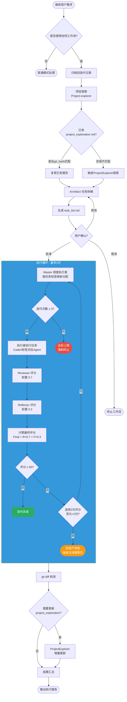
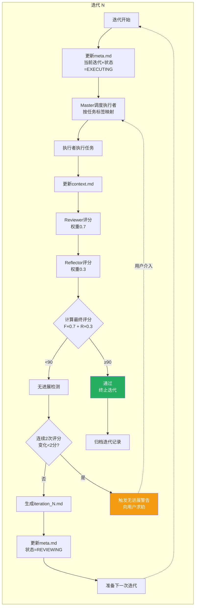
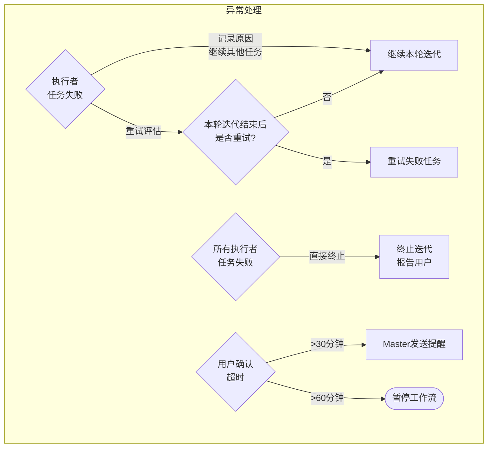
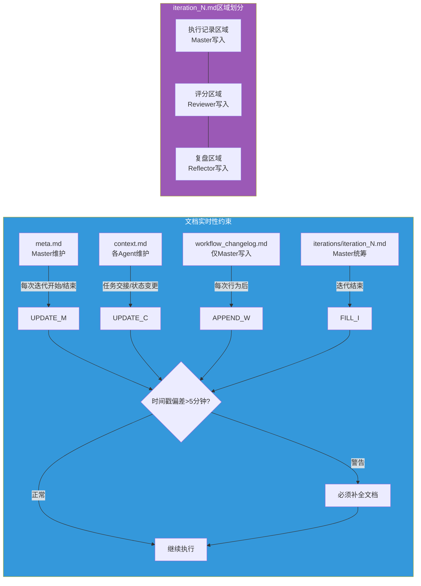
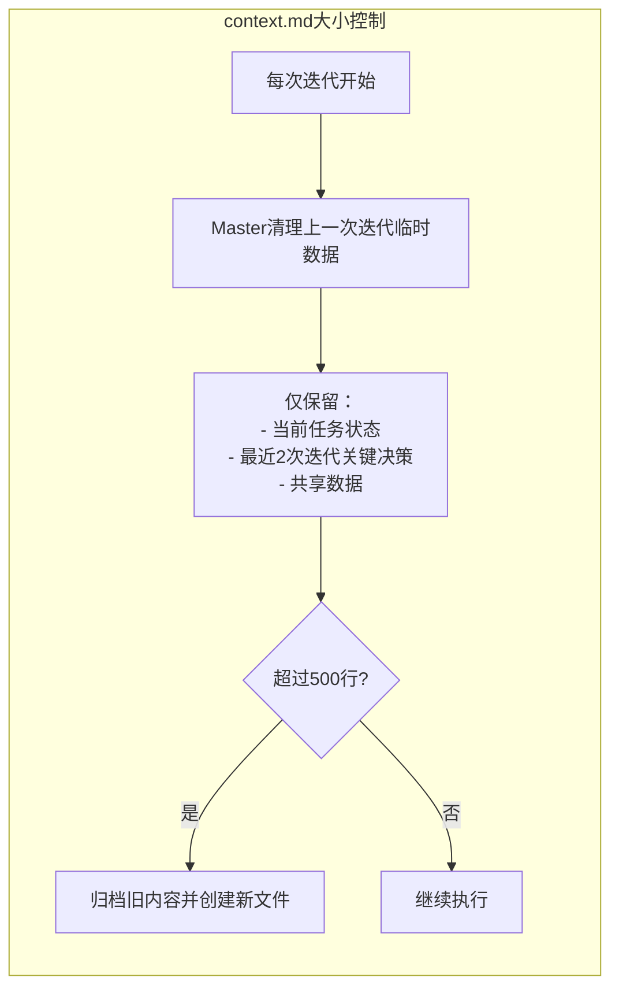
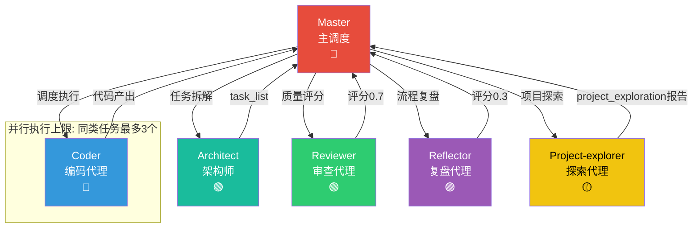
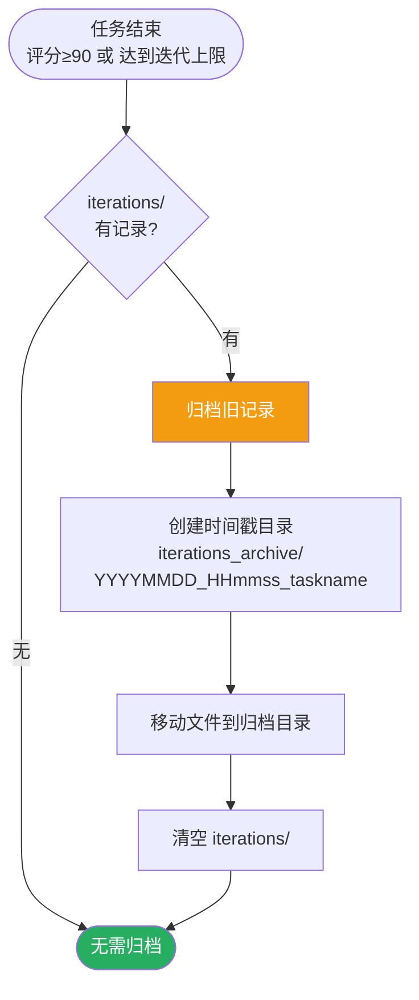
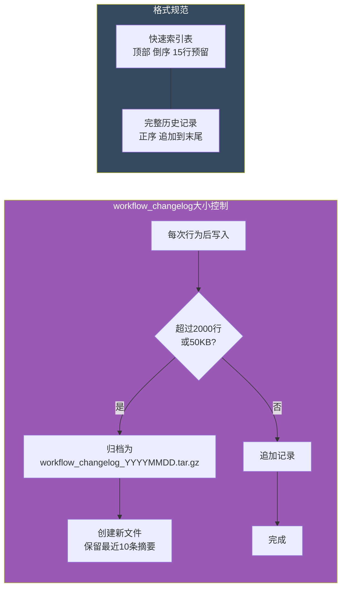
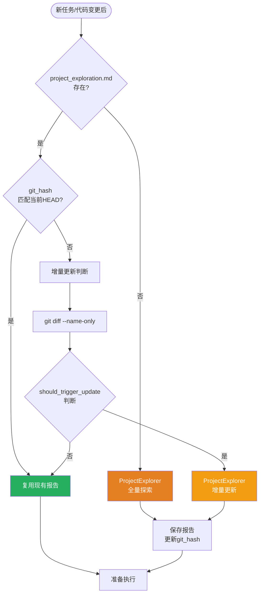
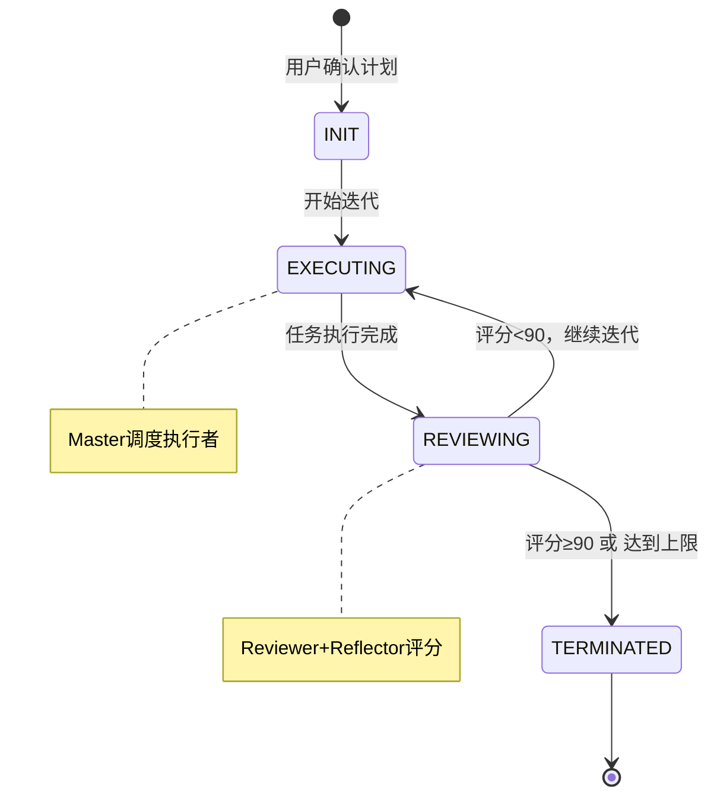

# Multi-Agent Workflow 流程图

> **规范来源**：`.opencode/skills/multi-agent-workflow/SKILL.md`
> 
> **生效角色**：Master、Architect、Project-explorer、Coder、Reviewer、Reflector

---

## 1. 主工作流程



---

## 2. 执行循环详细流程



---

## 3. 异常处理流程



---

## 4. 文档更新约束



### 4.1 context.md 大小控制



**规则**：
- 每次迭代开始时，Master清理上一次迭代的临时数据
- 仅保留：当前任务状态、最近2次迭代的关键决策、共享数据
- 超过500行时，Master必须归档旧内容并创建新文件

---

## 5. Agent 职责与协作



---

## 6. 迭代记录归档流程



**规则**：
- 执行时机：任务结束时（评分≥90或达到最大迭代次数），在结果汇总之前
- 执行者：Master
- 禁止：直接删除旧记录或覆盖
- 禁止：将归档延迟到新任务启动时

---

## 7. workflow_changelog.md 管理



---

## 8. 项目探索报告管理



---

## 图例说明

| 颜色 | Agent/组件 |
|------|-----------|
| 🔴 红色 | Master（主调度） |
| 🟢 青色 | Architect（架构师） |
| 🔵 蓝色 | Coder（编码代理） |
| 🟢 绿色 | Reviewer（审查代理） |
| 🟣 紫色 | Reflector（复盘代理） |
| 🟡 黄色 | Project-explorer（探索代理） |

---

## 评分公式

```
最终评分 = Reviewer得分 × 0.7 + Reflector得分 × 0.3
```

## 终止条件

- ✅ 评分 ≥ 90 分
- ✅ 达到 3 次迭代
- ⚠️ 连续 2 次评分变化 < 2 分（需用户介入）

---

## 状态流转



---

## 文档维护矩阵

| 文件 | 维护者 | 更新时机 | 区域划分 |
|------|--------|----------|----------|
| meta.md | Master | 每次迭代开始/结束 | - |
| context.md | 各Agent | 任务交接/状态变更 | 仅追加自身状态 |
| workflow_changelog.md | Master | 每次工作流行为后 | 快速索引+完整记录 |
| iteration_N.md | Master统筹 | 迭代结束后 | Master/Reviewer/Reflector 各自区域 |
