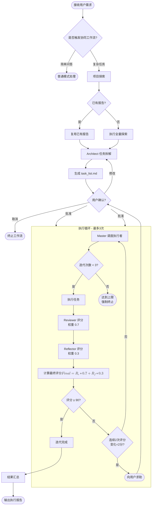
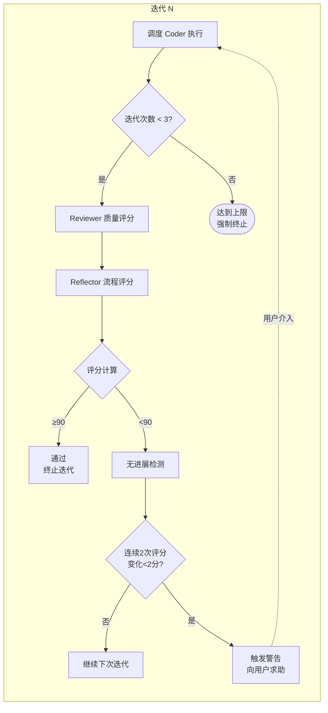
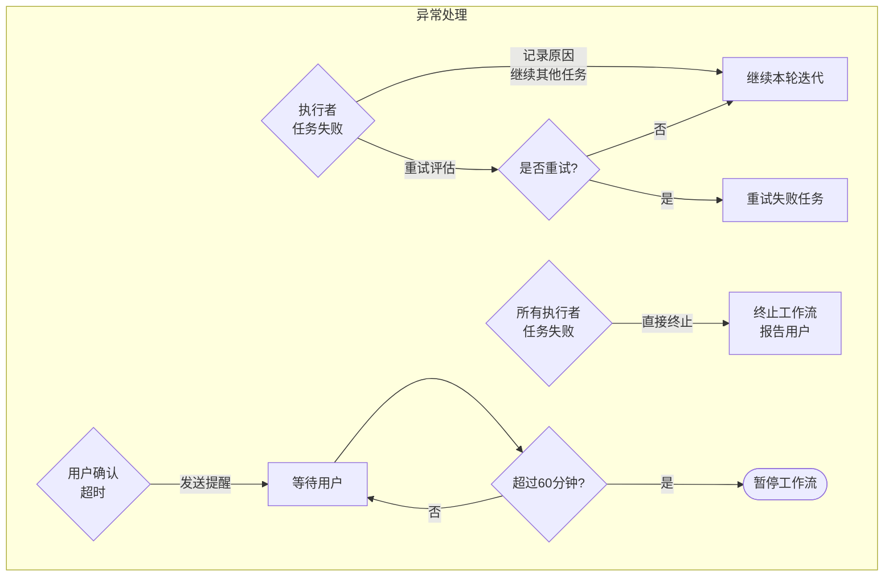
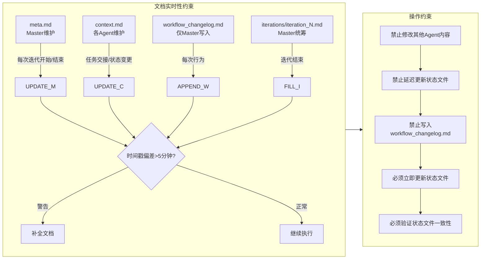
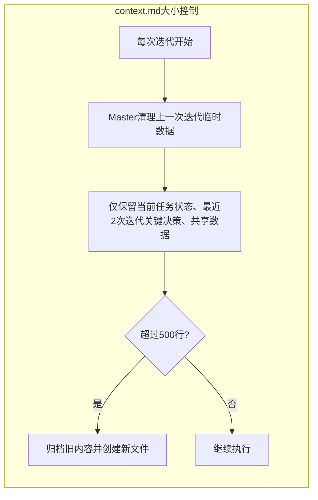
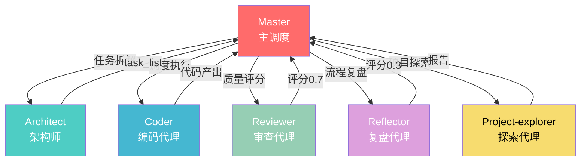
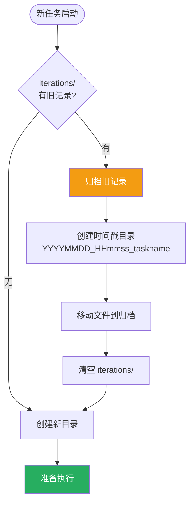

# Multi-Agent Workflow 流程图

## 1. 主工作流程



## 2. 执行循环详细流程



## 3. 异常处理流程



## 4. 文档更新约束



### 4.1 context.md 大小控制



**规则**：
- 每次迭代开始时，Master清理上一次迭代的临时数据
- 仅保留：当前任务状态、最近2次迭代的关键决策、共享数据
- 超过500行时，Master必须归档旧内容并创建新文件

## 5. Agent 职责与协作



## 6. 迭代记录归档流程



---

## 图例说明

| 颜色 | Agent/组件 |
|------|-----------|
| 🔴 红色 | Master（主调度） |
| 🟢 青色 | Architect（架构师） |
| 🔵 蓝色 | Coder（编码代理） |
| 🟢 绿色 | Reviewer（审查代理） |
| 🟣 紫色 | Reflector（复盘代理） |
| 🟡 黄色 | Project-explorer（探索代理） |

## 评分公式

```
最终评分 = Reviewer得分 × 0.7 + Reflector得分 × 0.3
```

## 终止条件

- ✅ 评分 ≥ 90 分
- ✅ 达到 3 次迭代
- ⚠️ 连续 2 次评分变化 < 2 分（需用户介入）
